# Assembly

## Outline

💡ℹ️ You can find an outline (table of contents) in the upper right corner of this GitHub file and expand it by clicking on the icon. Click on the titles to jump to the corresponding section.

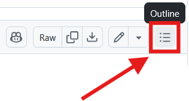

## Part list

Please check the part list in the [BOM section](Shopping_list.md)

## Tool list

Check that you have all the tools you need:

- A set of screw drivers and wrenches for hexagon screws (M3, M5 and M8)
- A set of allen keys
- Pliers

## Assembly

The assembly instructions are divided into several modules. These do not necessarily have to be assembled in the order listed below. Several people can also work on different modules at the same time. At the end, all modules must be assembled together.

## 1. Frame

<table> <tr> <td> 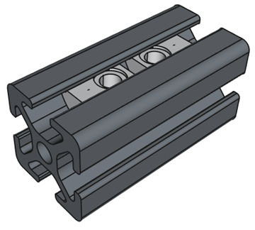 </td> <td> <ul>
        <li>Insert 2 t-nuts (M5) in one of the t-slot profiles (length 41 mm). You will need them later to assemble the brake.</li>
</table>

<table> <tr> <td> 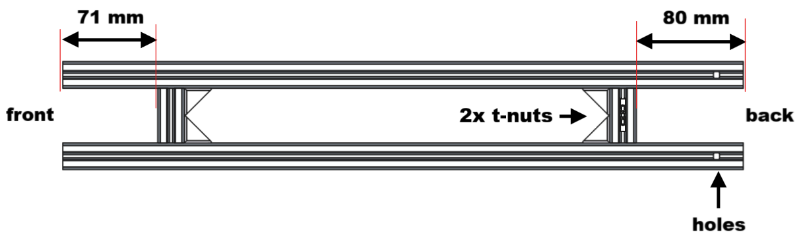   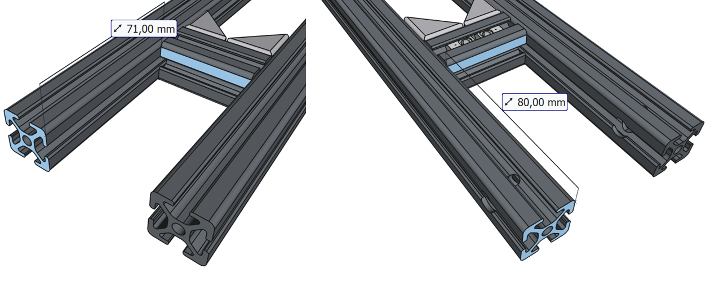   </td> <td> <ul>
        <li>Assamble the following 20x20 t-slot profiles:
          <ul>
            <li>length 509 mm (2 pieces)</li>
            <li>length 41 mm (2 pieces)</li>
          </ul>
        </li>
        <li>Use four 20x20 angles for mounting</li>
        <li>For each angle, you will need 2x M5 screws and 2x t-nuts</li>
        <li>Make sure to move the 41-mm-profiles to the right position (80 mm for the back part, 71 mm for the front part)</li>
        <li>Make sure to put the part with the 2 t-nuts (for the brake) in the back part of the frame (with a distance 80 mm)</li>
        <li>Make sure that the drilled holes are in the back</li>
        <li>Make sure that everything is parallel and at right angles</li>
        <li>Insert the M8 x 95 screw through the holes and make sure that it fits well</li>
        <li>Do not fasten the screw yet. If the screw fits, remove it again. The rear wheel will be mounted later.</li>
      </ul> </td> </tr> </table>

<table> <tr> <td> 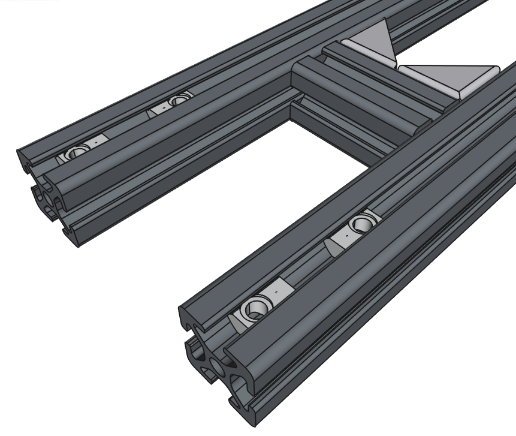   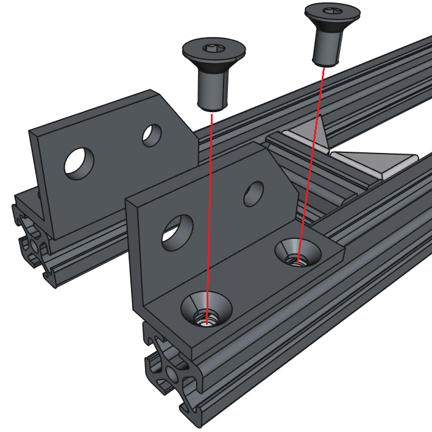   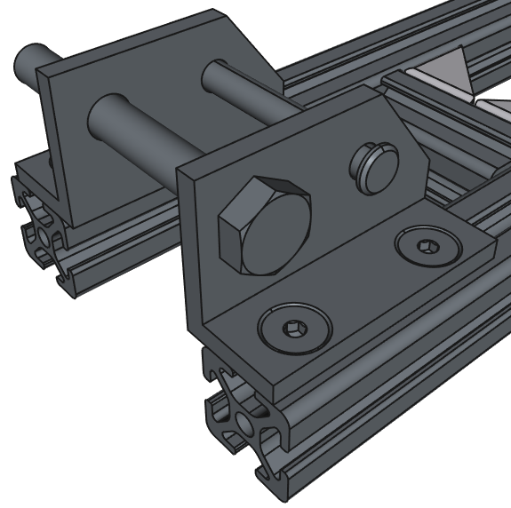 </td> <td> <ul>
        <li>Insert 4x t-nuts (with M5 holes) in the frame (2 on each side)</li>
        <li>Insert them on the front part of the frame (where the distance of the profile is 71 mm and where are no holes)</li>
        <li>Mount the two angles using 2x M5 x 10 countersunk screws for each part</li>
        <li>Ensure that the angles are flush with the profiles</li>
        <li>Insert the M8 x 65 screw through the bigger hole and the bolt through the smaller hole and make sure everything fits well</li>
        <li>Do not fasten the screw and the bolt yet. If the screw and the bolt fit, remove them again. These parts will be mounted later</li>
</table>

<table> <tr> <td> 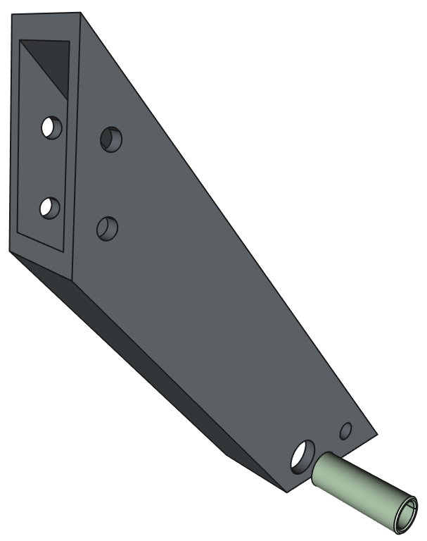   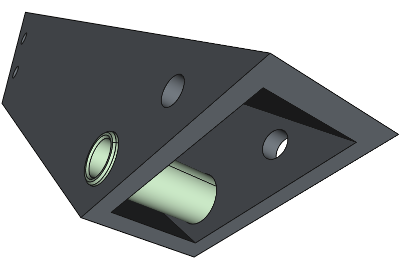   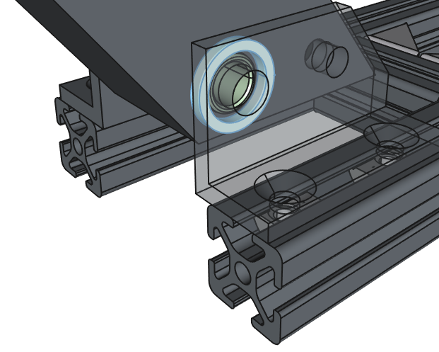   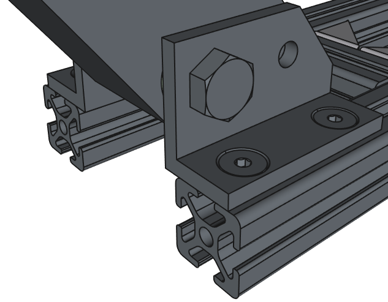</td> <td> <ul>
        <li>Insert the 3D-printed (nylon) plain bearing in the largest hole of the cross connection. It should sit tightly inside the hole.</li>
        <li>Mount the cross connection between the angles, using two 3D-printed spacers (18 x 2,5 or 18 x 1,9) and an M8 x 65 screw with washers on each side (washers not shown in the image)</li>
        <li>Try the 18 x 2,5 spacers first. If they don't fit, try the 18 x 1,9 ones. If none of them fit, edit the file in FreeCAD or in a slicer software and print spacers that fit well. The cross connection part should not wobble</li>
        <li>Tighten the screw with an M8 nut (not shown in the image)</li>
        <li>Test the connection. The part should be rotatable.</li>
</table>

<table> <tr> <td> 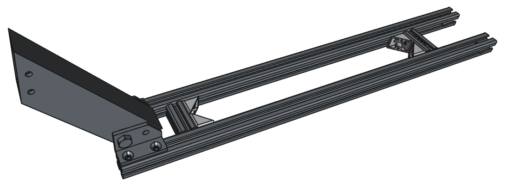 </td> <td> <ul>
        <li>The frame is now fully assembled. Set it aside and continue with the assembly of the other modules.</li>
</table>

## 2. Front wheel and fork

<table> <tr> <td> 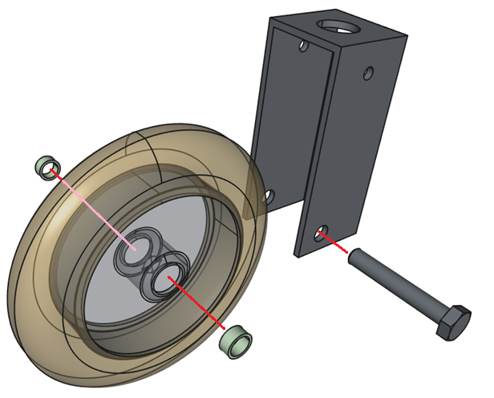   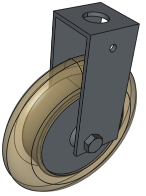   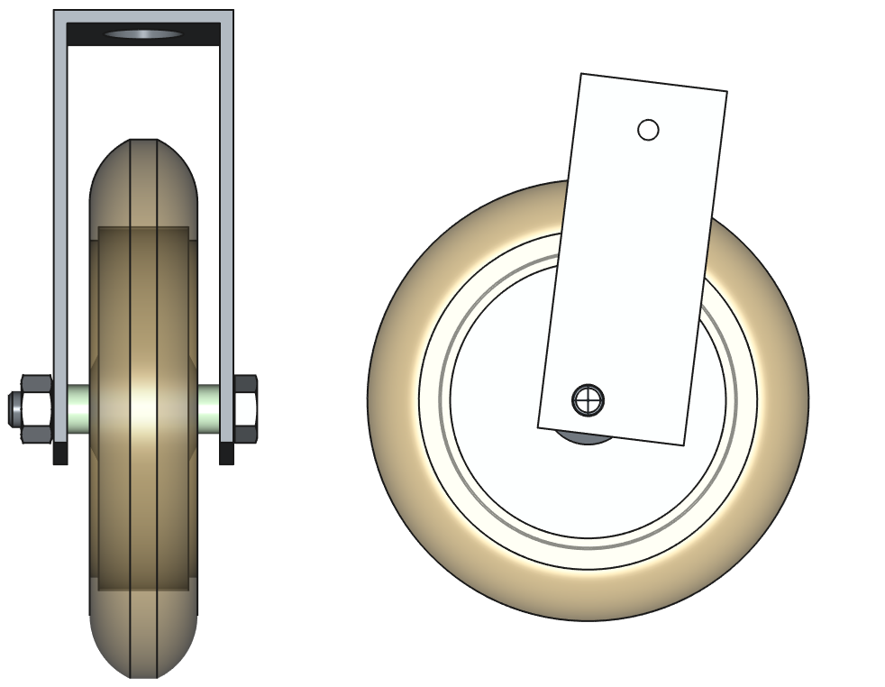 </td> <td> <ul>
        <li>Prepare the following parts
                <ul>
                        <li>Fork</li>
                        <li>Front wheel (diameter 120 mm)</li>
                        <li>2x 3D-printed spacers (11 x 5 mm)</li>
                        <li>M8 x 50 screw</li>
                        <li>M8 nut (only shown in the third image)</li>
                        <li>2x washers (not shown in the images)</li>
                </ul>
        </li>
        <li>Have a pair of pliers ready that are narrow enough to insert the spacers.</li>
        <li>Put a washer on the screw</li>
        <li>Insert the screw through the hole (just a few millimeters beyond the hole)</li>
        <li>Put one of the spacers on the tip of the screw</li>
        <li>Hold the wheel and the other spacer (using the pliers) in position, then push the screw all the way through</li>
        <li>Put the second washer on the end of the screw and fasten it with an M8 nut</li>
        <li>Test the assembly. Make sure the wheel spins well and that it doesn't wobble.</li>
</table>

## 3. Handlebar (top part)

<table> <tr> <td>
        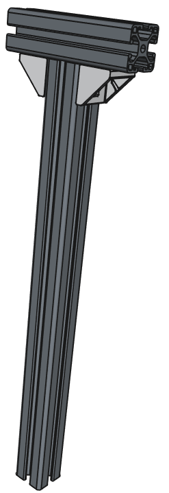   
        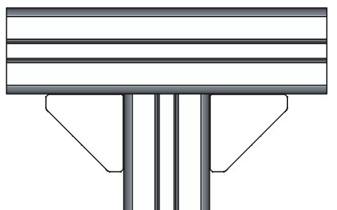   
        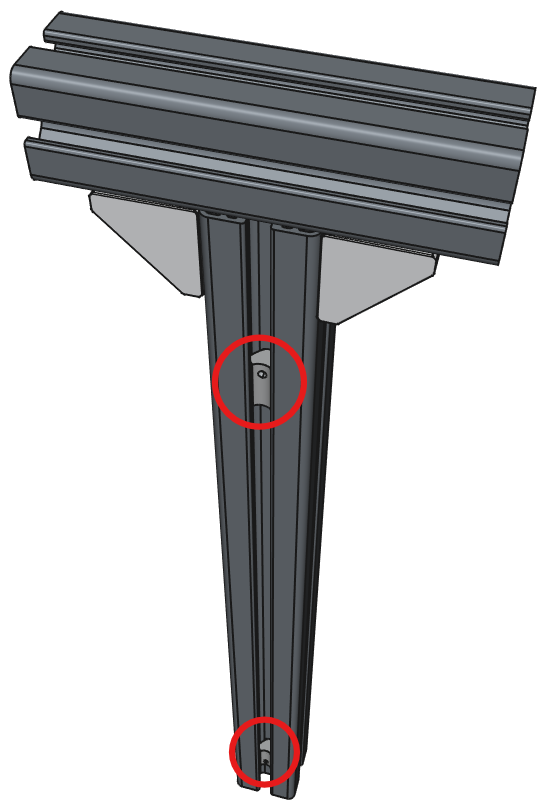   
        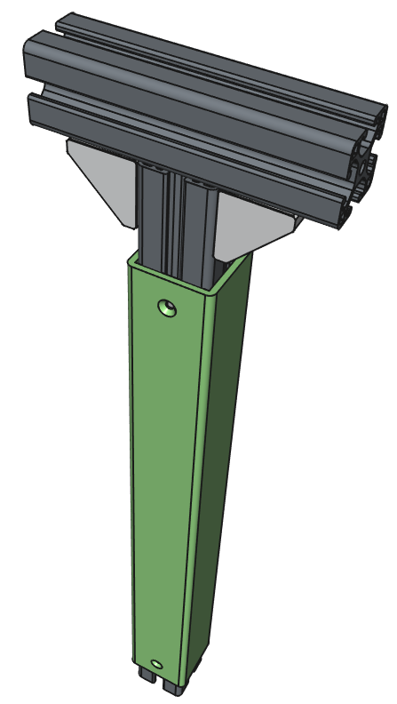
</td> <td> <ul>
        <li>Assemble the two 30x30 profiles together (lenght 364 and 112 mm)</li>
        <li>Use two 30x30 angles for mounting</li>
        <li>For each angle, you will need 2x M5 screws and 2x t-nuts</li>
        <li>Make sure that the short profile on the top is centered</li>
        <li>If available, insert a cover cap on each angle (not shown in the images, not necessary, only for appearance)</li>
        <li>Insert two t-nuts (M3) in the front part of the long profile (red circles ⭕ in the image)</li>
        <li>Mount the 3D-printed case, using two M3 x 12 countersunk screws (screw them into the t-nuts)</li>
</table>

<table> <tr> <td>
        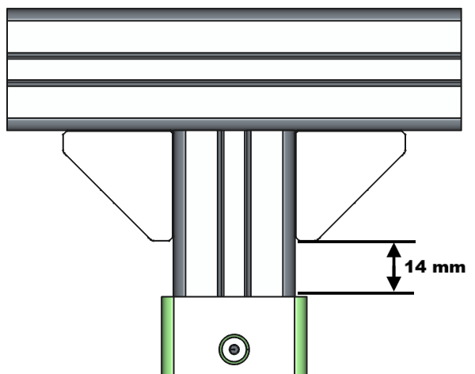   
        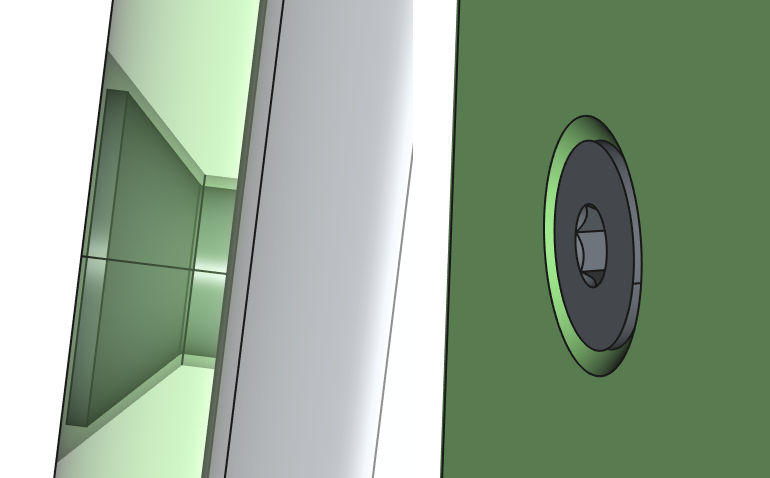
</td> <td> <ul>
        <li>The distance between the top edge of the 3D-printed case and the edge of the angle should be about 14 mm </li>
        <li>This is important, so the front cover will fit. You can correct the distance later when mounting the front cover.</li>
        <li>Ensure that the countersunk screws are well hidden below the surface of the cover   so that they do not scratch the inner wall of the aluminum square profile later on.</li>
</table>

## 4. Handlebar (bottom part)

<table> <tr> <td>
        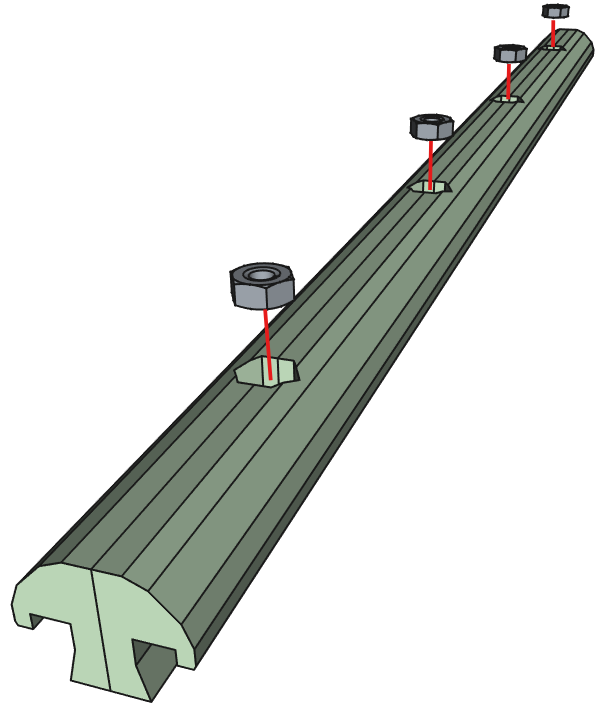   
        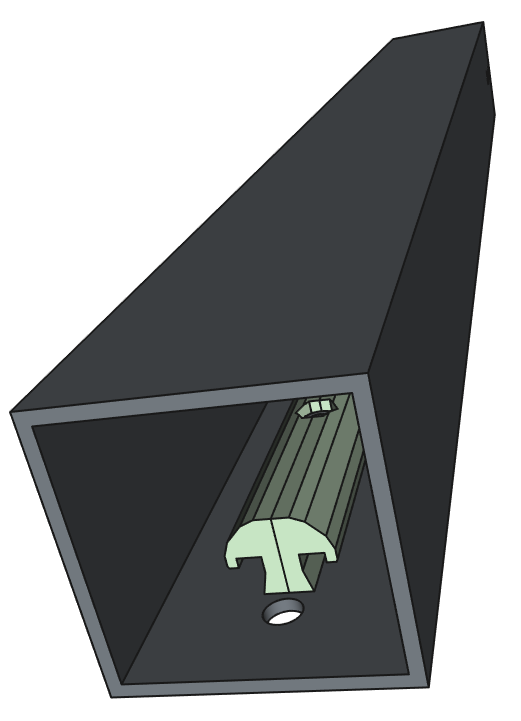  
        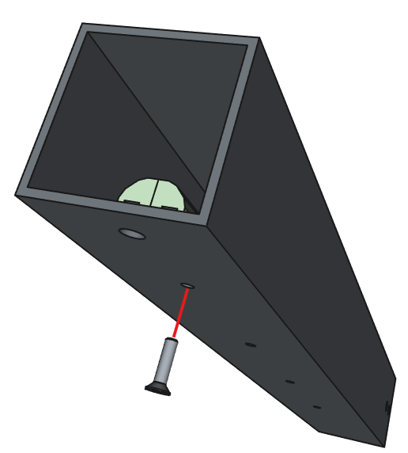 
</td> <td> <ul>
        <li>Insert four M3 nuts in the pockets of the nylon rail. Push them in as far as you can.</li>
        <li>Place the nylon rail with the M3 nuts inside the bottom part of the handlebar (40 x 40 mm aluminum square tube, length 373 mm)</li>
        <li>Align the 4 holes of the nylon rail with the 4 smaller holes in the square tube</li>
        <li>It might make assembly easier if you lay the square profile flat (as shown in the image)</li>
        <li>Use four M3 x 12 countersunk screws to attach the nylon rail inside the square tube (only one screw shown in the image)</li>
</table>

<table> <tr> <td>
        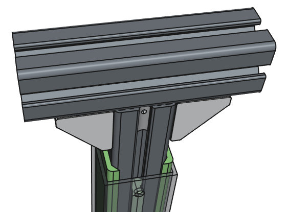   
</td> <td> <ul>
        <li>It might make assembly easier if you insert the upper handlebar first so that it holds the nylon rail in position.</li>
</table>

<table> <tr> <td>
        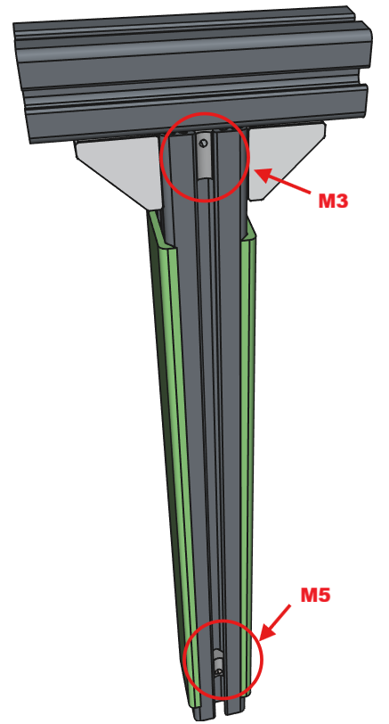   
        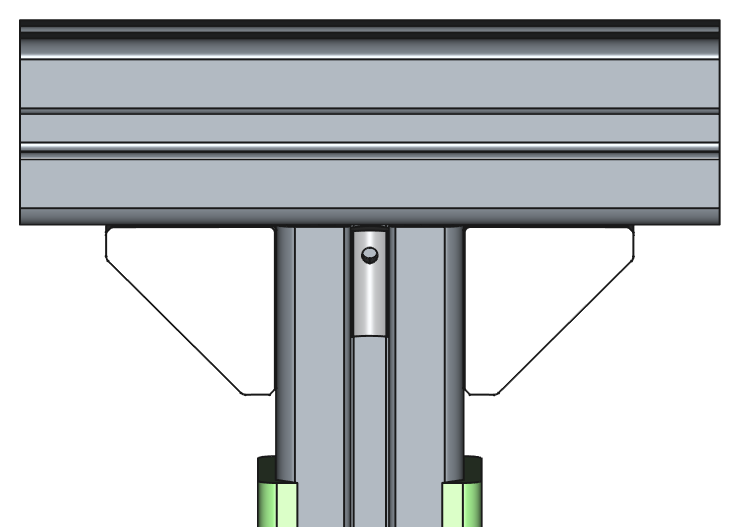  
        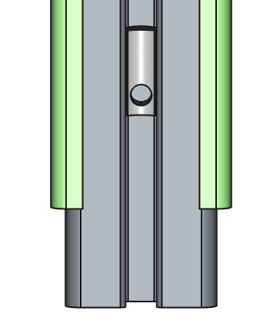 
</td> <td> <ul>
        <li>Insert a t-nut (M3) inside the t-slot profile of the handlebar (top part) and move it all the way to the top. You will need it later to assamble the front cover.</li>
        <li>Insert a t-nut (M5) inside the t-slot profile and position it in the lower part of the profile</li>
</table>

<table> <tr> <td>
        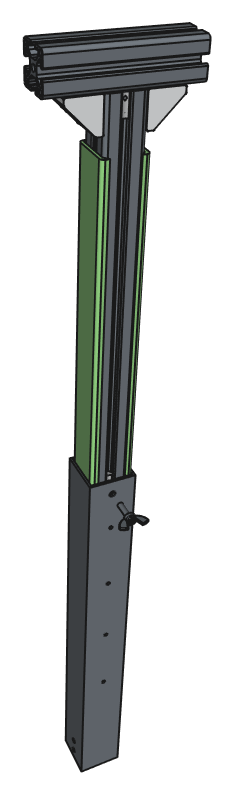   
</td> <td> <ul>
        <li>Insert the handlebar (top part) inside the handlebar (bottom part)</li>
        <li>It should slide in smoothly, but at the same time it should be relatively tight and not wobble</li>
        <li>If it doesn't fit right, use a deburrer to smooth the edges of the 3D-printed case slightly and try again</li>
</table>

<table> <tr> <td>
        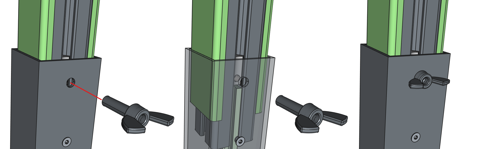   
</td> <td> <ul>
        <li>Insert an M5 x 16 wing screw in the top hole of the square tube</li>
        <li>Screw it into the t-nut</li>
</table>

<table> <tr> <td>
        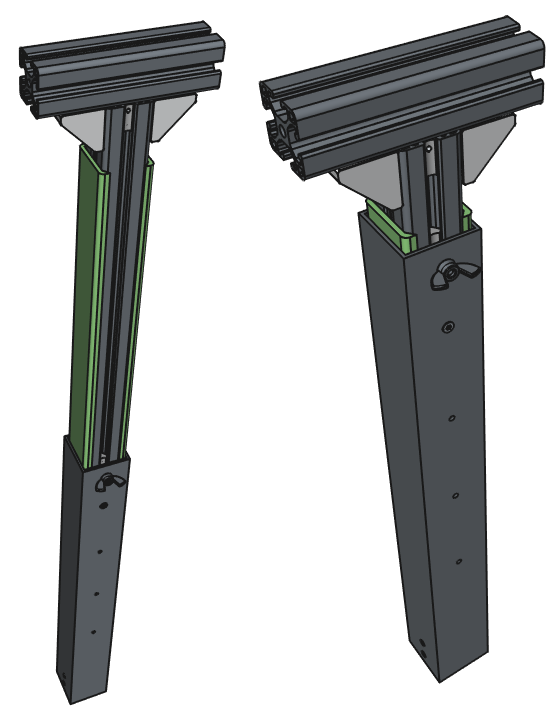   
</td> <td> <ul>
        <li>Check whether you can adjust the height of the handlebars.   Loosen the wing screw, adjust the height, and then tighten the wing screw again.</li>
</table>

<table> <tr> <td>
        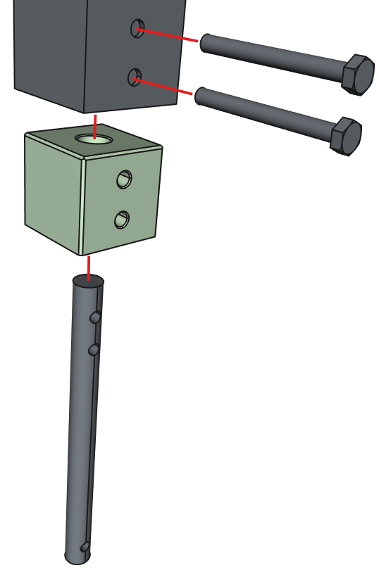   
        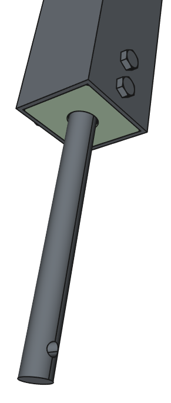
</td> <td> <ul>
        <li>Insert the 3D-printed (nylon) connector in the bottom of the square tube</li>
        <li>Slide the axle (with the two holes at the top) into the 3D-printed connector</li>
        <li>Use two M5 x 50 screws with washers on each side (not shown in the images) to assamble the parts</li>
        <li>Use two M5 nuts to fasten the screws</li>
</table>

<table> <tr> <td>
        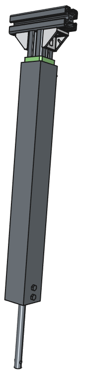   
</td> <td> <ul>
        <li>The handlebar (top and bottom part) is now fully assembled. Set it aside and continue with the assembly of the other modules.</li>
</table>

## 5. Bearing box

<table> <tr> <td>
        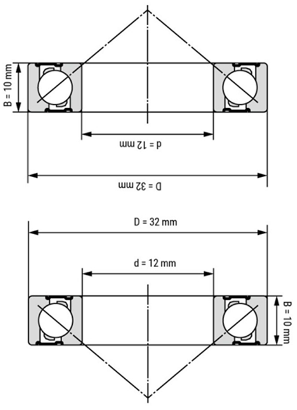   
</td> <td> <ul>
        <li>Before we start assembling the bearing box, we need to unterstand how the   "angular contact ball bearings" (German "Schrägkugellager") work</li>
        <li>There are two ways to assamble a pair of angular contact ball bearings:</li>
                <ul>
                        <li>face-to-face arrangement (German "O-Anordnung")</li>
                        <li>back-to-back arrangement (German "X-Anordnung")</li>
                </ul>
        <li>For the orcuScooter, we want to use the face-to-face arrangement (see image)</li>
        <li>This means that the wide parts of the inner rings of the ball bearings must face outward,   while the narrow parts of the inner rings face inward</li>
        <li>When the ball bearings are inserted into the housings, the wide parts of the inner rings must be visible</li>
</table>

<table> <tr> <td>
        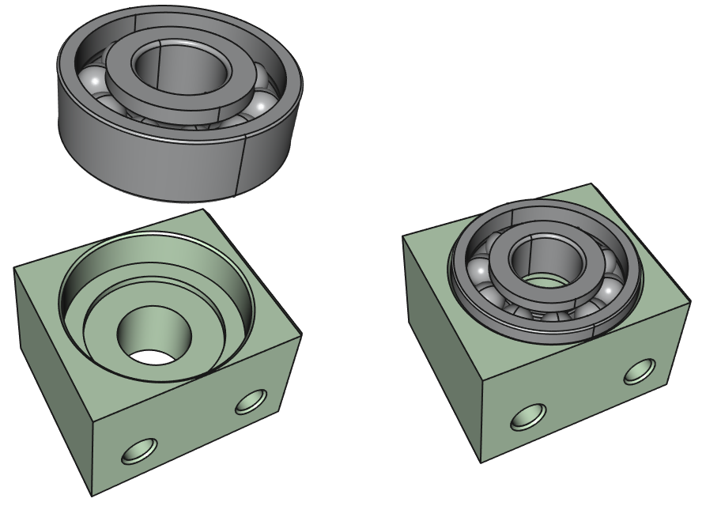   
        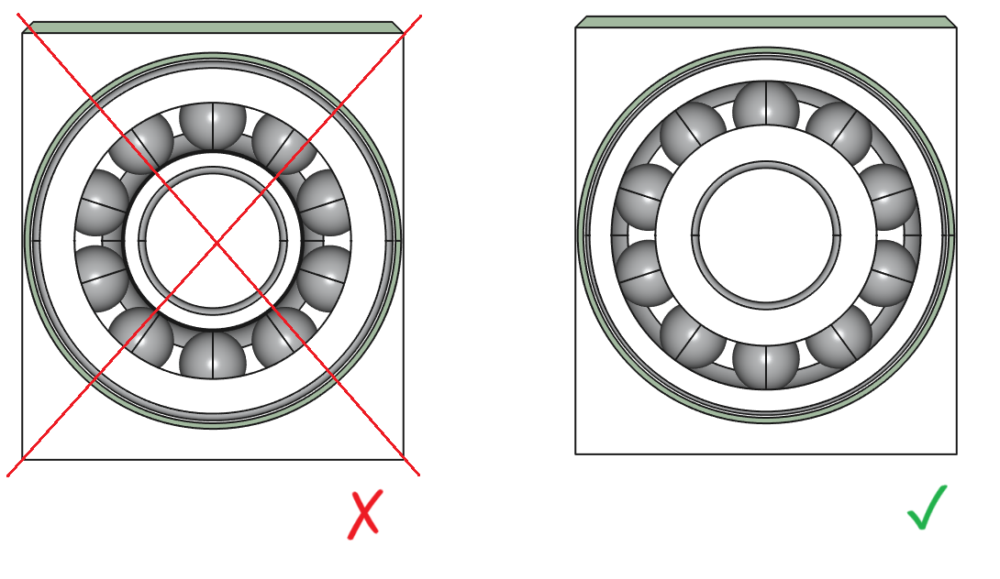
</td> <td> <ul>
        <li>Insert the ball bearings in the 3D-printed (nylon) bearing housings</li>
        <li>As mentioned above, the wide part of the inner ring must face outward</li>
        <li>The wide part of the inner ring must be visible, while the narrow part   is inside the housing (not visible)</li>
        <li>Assamble both bearing housings with the bearings the same way,   so you have two sets of identical bearing housings, each with a bearing inside</li>
</table>

<table> <tr> <td>
        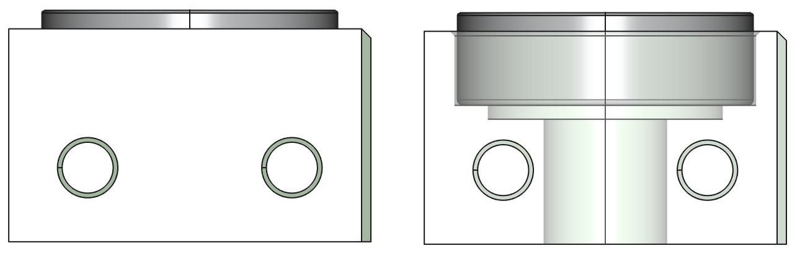
</td> <td> <ul>
        <li>Note that the bearings do not completely submerge   into the housings, but protrude approx. 2 mm.</li>
</table>

<table> <tr> <td>
        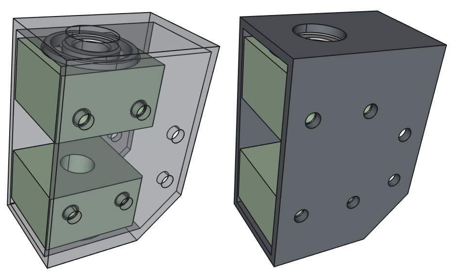   
        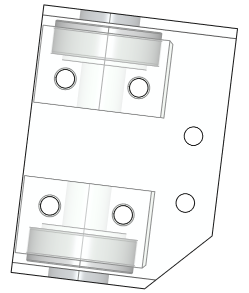  
        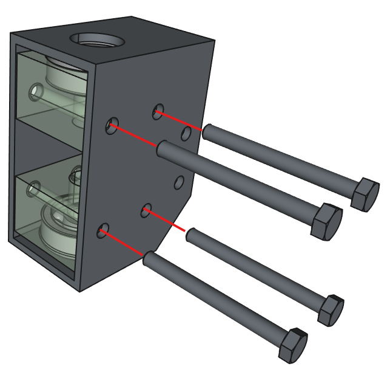
</td> <td> <ul>
        <li>Insert the housings with the bearings inside the aluminum bearing box</li>
        <li>Make sure that both bearings are facing outward (see image)</li>
        <li>Align the holes of the housings with the holes of the aluminum bearing box</li>
        <li>For each bearing box, use two M5 x 50 screws with washers on each side (not shown in the images)</li>
        <li>Fasten each of the 4 screws with an M5 nut (not shown in the images)</li>
</table>

<table> <tr> <td>
        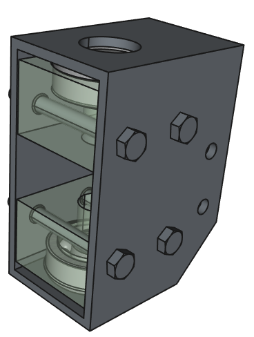   
</td> <td> <ul>
        <li>The bearing box is now fully assembled. Set it aside and continue with the assembly of the other modules.</li>
</table>

## 6. Rear wheel

<table> <tr> <td>
        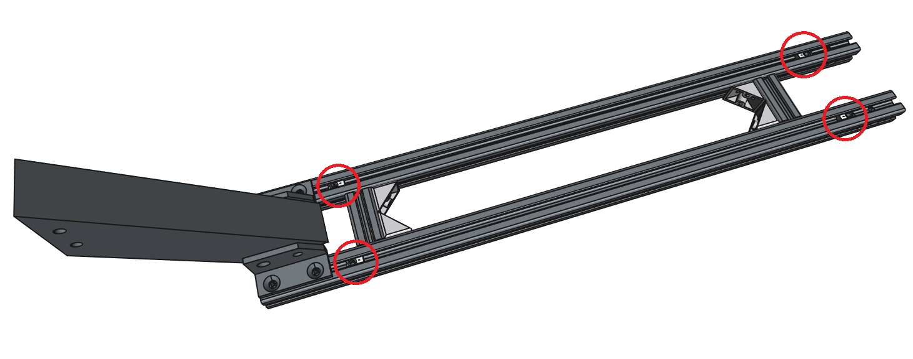   
        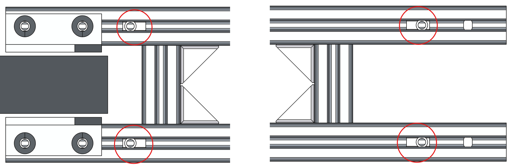
</td> <td> <ul>
        <li>Before installing the rear wheel, insert four M5 t-nuts   in the frame (two on each side)</li>
        <li>You will need the t-nuts later for assembling the deck.</li>
        <li>Position the t-nuts as shown in the images. The exact   position can be corrected later when assembling the deck</li>
        <li>Make sure the two t-nuts in the back part are positioned   past the hole for the axle screw for the rear wheel</li>
</table>

<table> <tr> <td>
        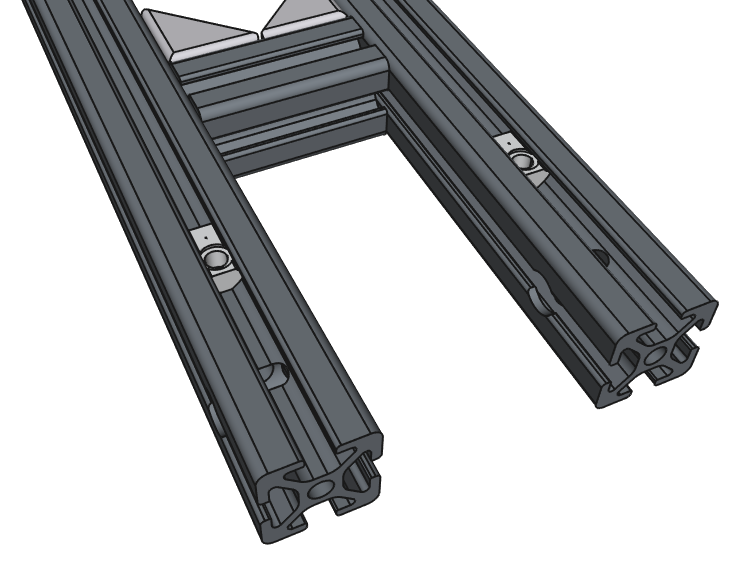   
        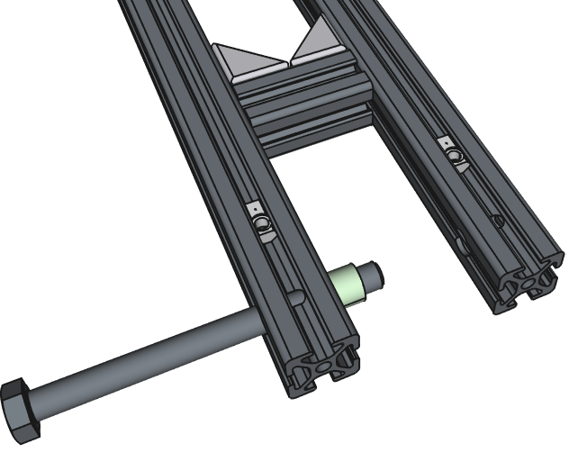  
        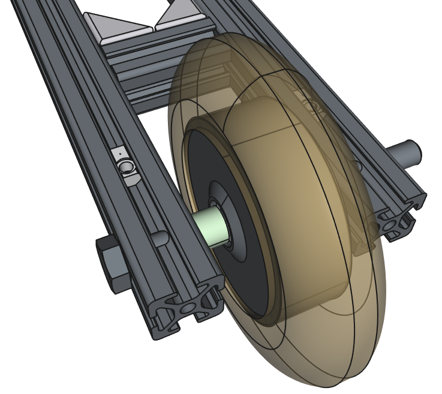
</td> <td> <ul>
        <li>Prepare the following parts
                <ul>
                        <li>Rear wheel (diameter 120 mm)</li>
                        <li>2x 3D-printed spacers (11 x 8,5 mm)</li>
                        <li>M8 x 95 screw</li>
                        <li>M8 nut (not shown in the images)</li>
                        <li>2x washers (not shown in the images)</li>
                </ul>
        </li>
        <li>Have a pair of pliers ready that are narrow enough to insert the spacers.</li>
        <li>Put a washer on the screw</li>
        <li>Insert the screw through the hole (just a few millimeters beyond the hole)</li>
        <li>Put one of the spacers on the tip of the screw</li>
        <li>Hold the wheel and the other spacer (using the pliers) in position, then push the screw all the way through</li>
        <li>Put the second washer on the end of the screw and fasten it with an M8 nut</li>
        <li>Test the assembly. Make sure the wheel spins well and that it doesn't wobble.</li>
</table>

## Assembling the complete handlebar

<table> <tr> <td>
        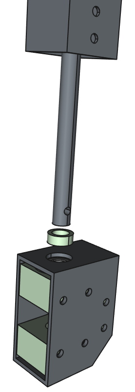
</td> <td> <ul>
        <li>Prepare the following modules and parts:</li>
          <ul>
                <li>assambled handle bar</li>
                <li>assambled bearing box</li>
                <li>3D-printed spacer (nylon) (17,4 x 6,5)</li>
          </ul>
        </li>
</table>

<table> <tr> <td>
        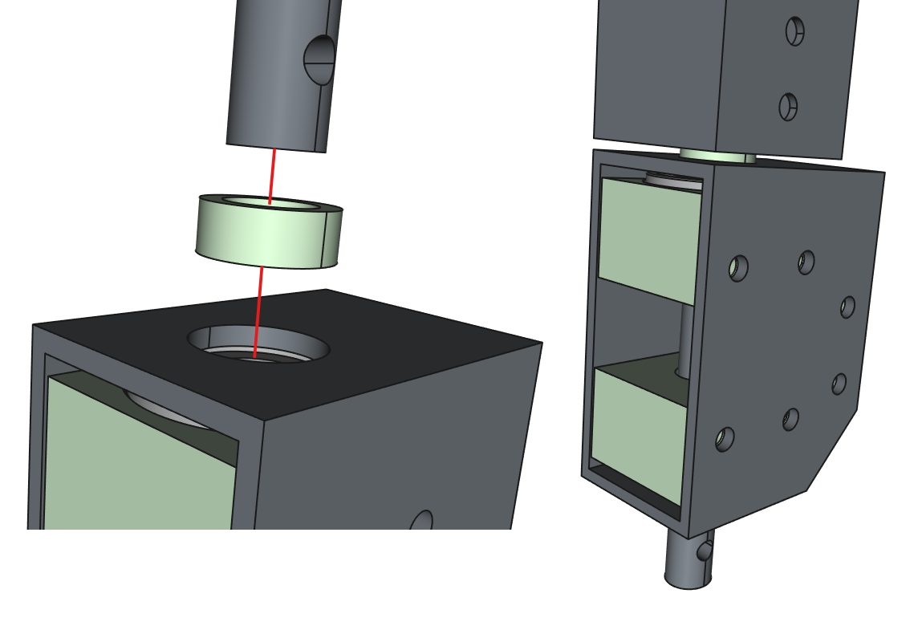
</td> <td> <ul>
        <li>Put the spacer on the tip of the axle</li>
        <li>Push the axle with the spacer through the all the holes and both bearings in the bearing box</li>
</table>

<table> <tr> <td>
        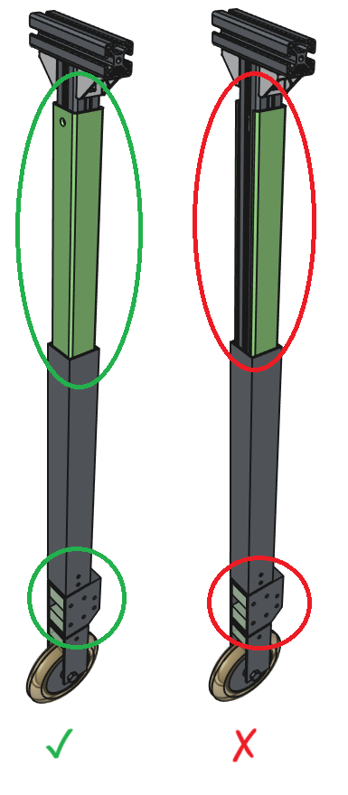  
        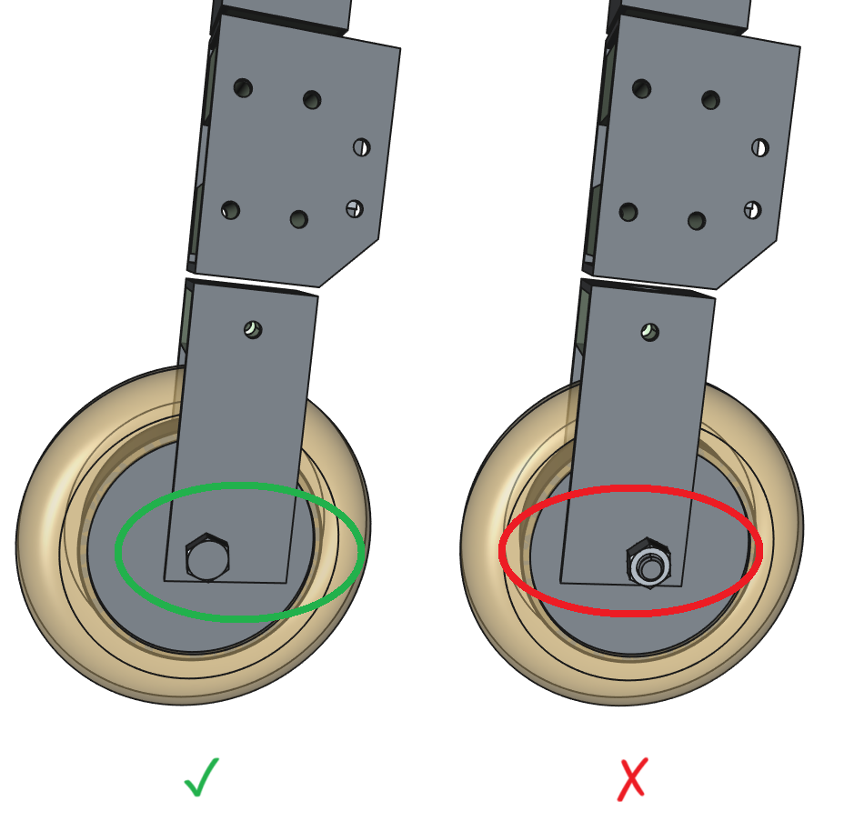
</td> <td> <ul>
        <li>For the next step, it is important that the handlebar   and the fork (with the front wheel) are correctly   aligned with each other</li>
        <li>Rotate the upper part of the handlebar so that   the 3D-printed cover faces forward (note the   orientation of the bearing box at the bottom)</li>
        <li>The fork must now be installed so that the axle   with the front wheel is at the front (and not   at the rear, see images)</li>
        <li>This is important for stability while riding the scooter</li>
</table>

<table> <tr> <td>
          
        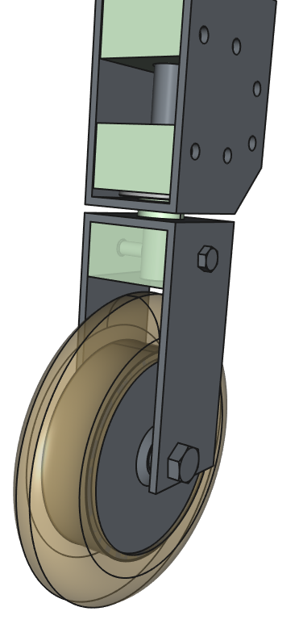
</td> <td> <ul>
        <li>Prepare the following modules and parts:</li>
          <ul>
                <li>assambled handle bar with the bearing box</li>
                <li>assambled fork with the front wheel</li>
                <li>3D-printed adapter (nylon)</li>
                <li>3D-printed spacer (nylon) (17,4 x 10)</li>
                <li>M5 x 50 screw</li>
                <li>2x washers</li>
                <li>M5 nut</li>
          </ul>
        <li>(1) Put the adapter inside the fork</li>
        <li>(2) Put the spacer on the tip of the axle, then push it   through the hole in the fork</li>
        <li>(3) Put a washer on the screw, then push the screw   through the hole</li>
        <li>Add another washer, then fasten the screw   with an M5 nut</li>
</table>

<table> <tr> <td>
        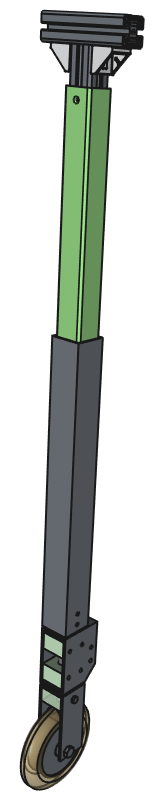
</td> <td> <ul>
        <li>The handle bar with the bearing box and the front wheel fork is now fully assembled. Continue with the final assembly.</li>
</table>

## Add the safety bolt for the folding mechanism

<table> <tr> <td>
        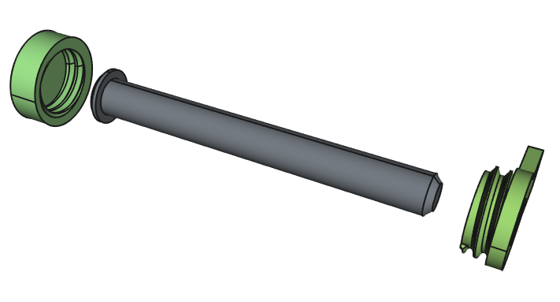  
        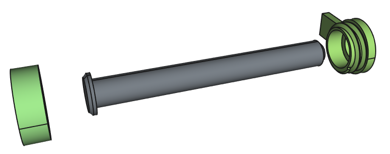  
        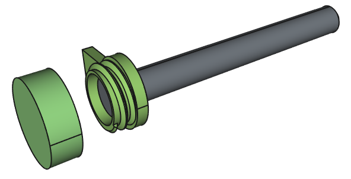  
        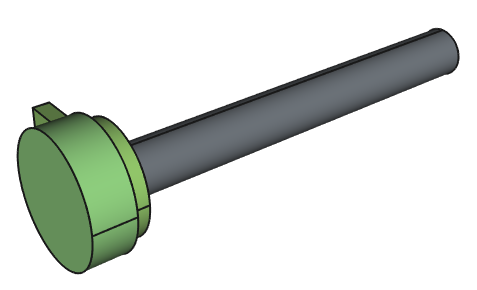
</td> <td> <ul>
        <li>Assamble the safety bolt</li>
                  <ul>
                <li>Push the bolt (6 x 50 ) through the 3D-printed (PLA) lever part</li>
                <li>Screw the 3D-printed (PLA) cap on the lever part</li>
          </ul>
</table>

<table> <tr> <td>
        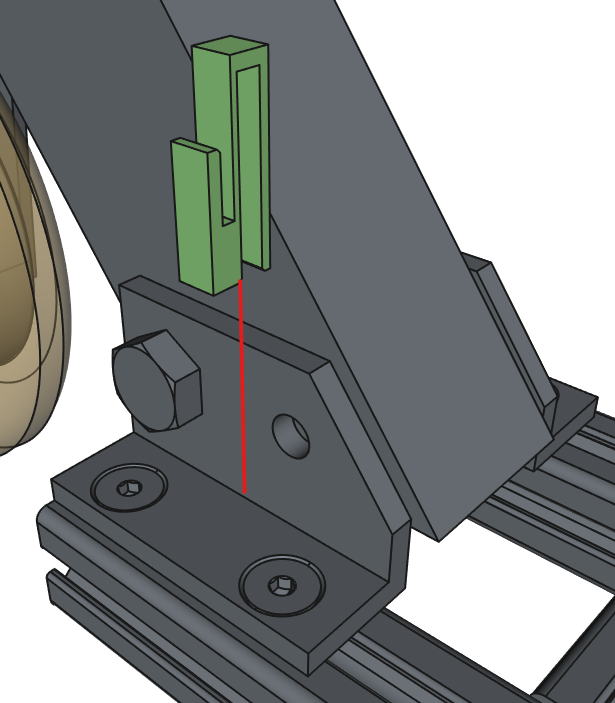  
        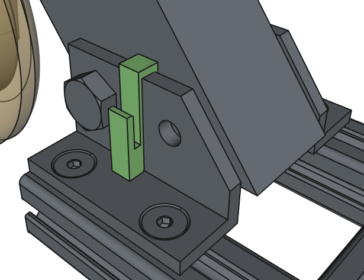
</td> <td> <ul>
        <li>Push the 3D-printed (PLA) bracket on the angle of the frame</li>
          </ul>
</table>

<table> <tr> <td>
        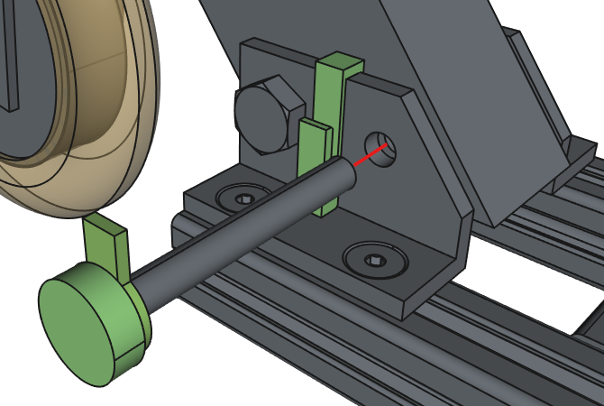  
        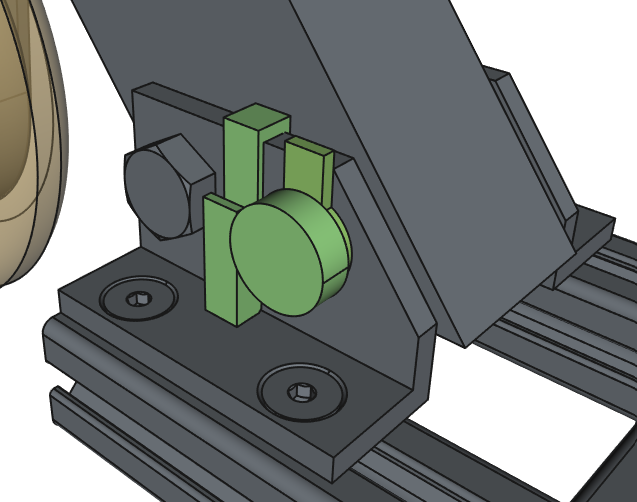
</td> <td> <ul>
        <li>Turn and position the cross connection so that the holes are aligned</li>
        <li>Push the bolt with the 3D-printed parts through all the holes</li>
          </ul>
</table>

<table> <tr> <td>
        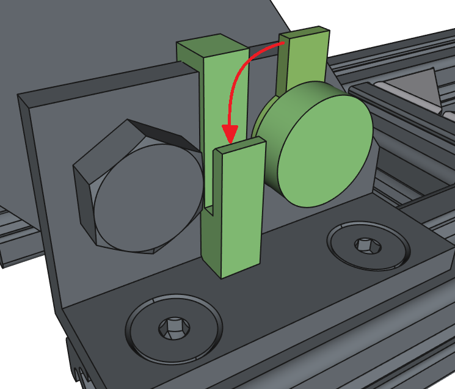  
        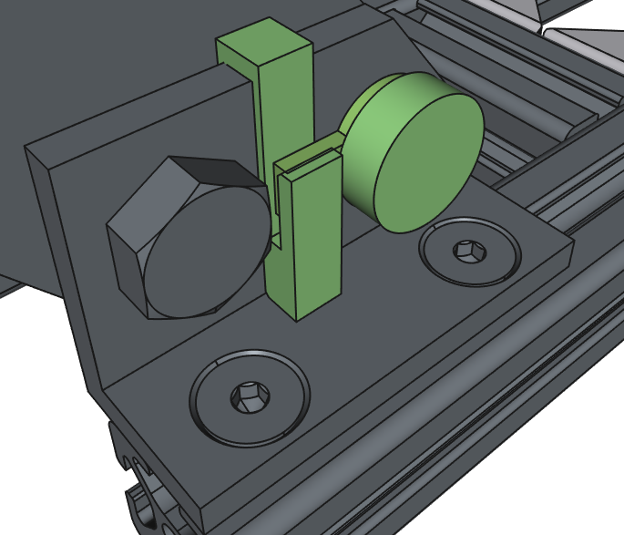
</td> <td> <ul>
        <li>Turn the lever on the bolt into the bracket. This prevents the bolt from slipping out while riding the scooter.</li>
          </ul>
</table>

## Test the folding mechanism

<table> <tr> <td>
        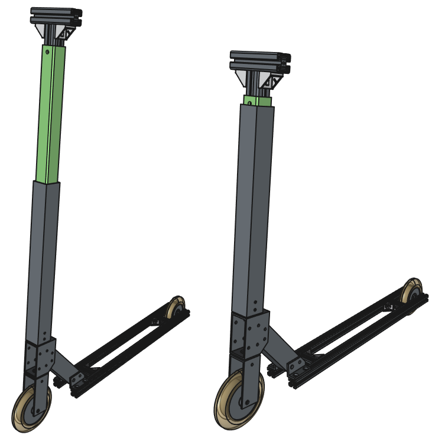
</td> <td> <ul>
        <li>Loosen the wing screw</li>
        <li>Push the handlebar down as far as it will go</li>
        <li>Tighten the wing screw again</li>
          </ul>
</table>

<table> <tr> <td>
        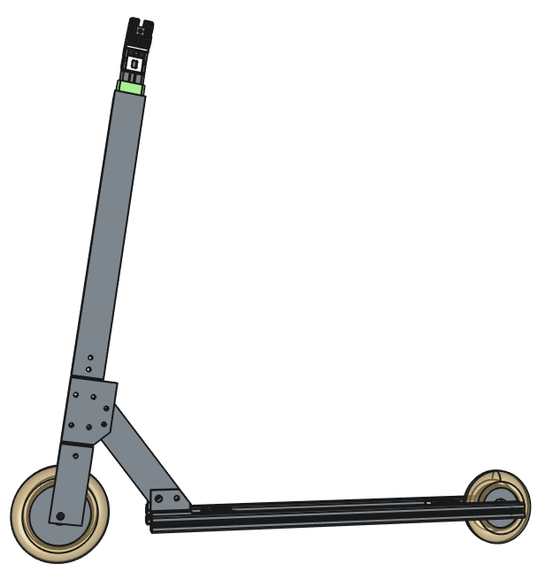  
        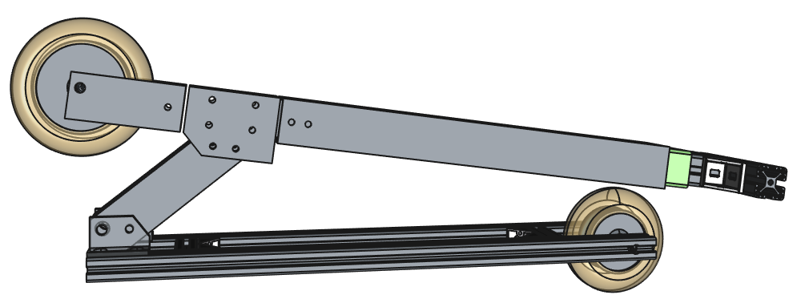
</td> <td> <ul>
        <li>Turn the lever to remove the safety bolt from the bracket</li>
        <li>Pull the safety bolt out</li>
        <li>Fold the scooter</li>
        <li>If everthing worked fine, fold the scooter back again and insert the safety bolt</li>
        <li>Turn the lever of the safety bolt back into the bracket</li>
          </ul>
</table>

## 🛴 Testing time!

The scooter is now ready for a first ride. Hop on, cruise to your heart's content and make sure everything is stable and sits right. If the scooter falls apart and you crash, there might be something wrong. Perhaps now is a good time to fix it, before you continue with the assembly.

But if the scooter has passed the test ride successfully: Well done! Continue with the instructions below.

## Brake

<table> <tr> <td>
        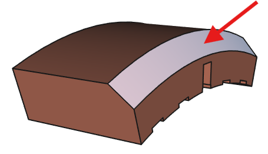  
        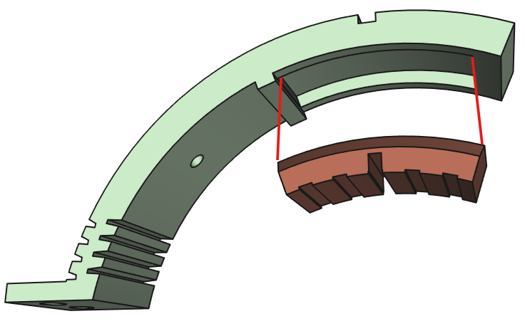  
        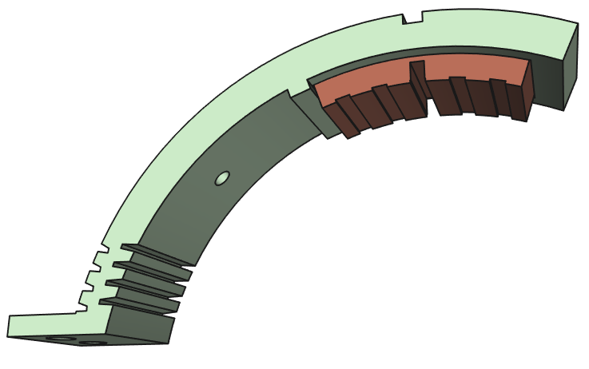
</td> <td> <ul>
        <li>Push the brake block into the brake part</li>
        <li>Note that the brake block has one slanted edge   and one straight edge.   Ensure correct alignment — the brake part also has these edges.</li>
          </ul>
</table>

<table> <tr> <td>
        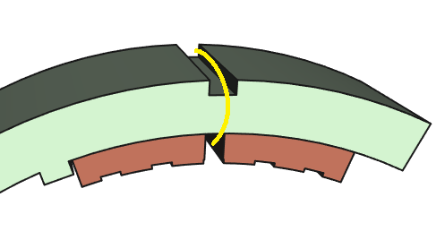
</td> <td> <ul>
        <li>If the brake block does not hold, you can use a rubber band (shown in yellow in the picture)</li>
        <li>If necessary, the rubber band must be wrapped twice</li>
          </ul>
</table>

<table> <tr> <td>
        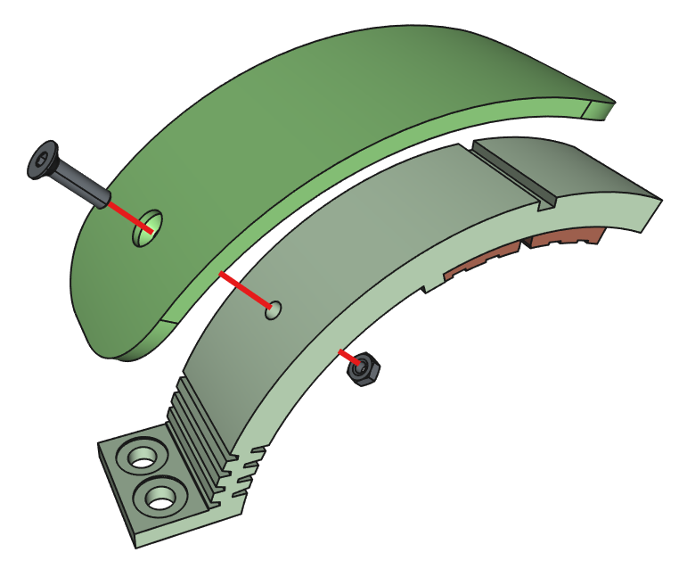  
        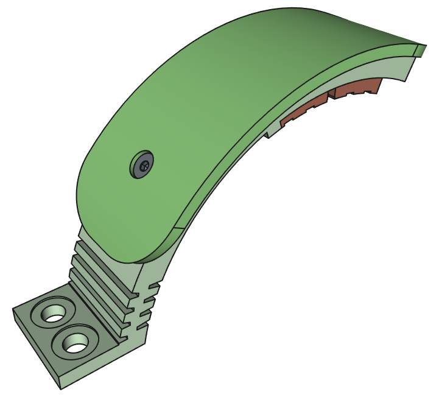  
        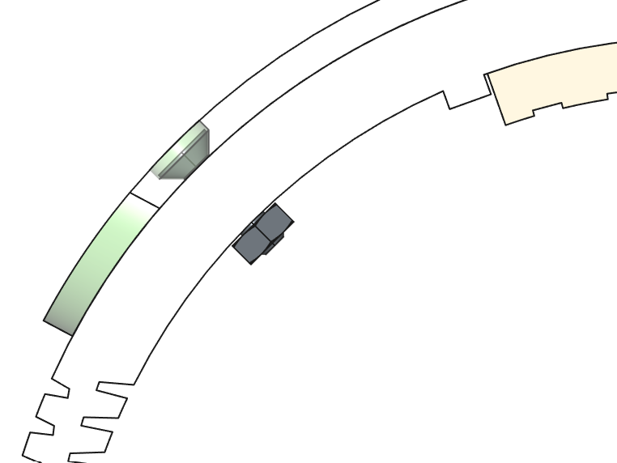
</td> <td> <ul>
        <li>Place the brake cover on the brake</li>
        <li>Use an M3 x 12 countersunk screw and an M3 nut to attach it</li>
          </ul>
</table>

<table> <tr> <td>
        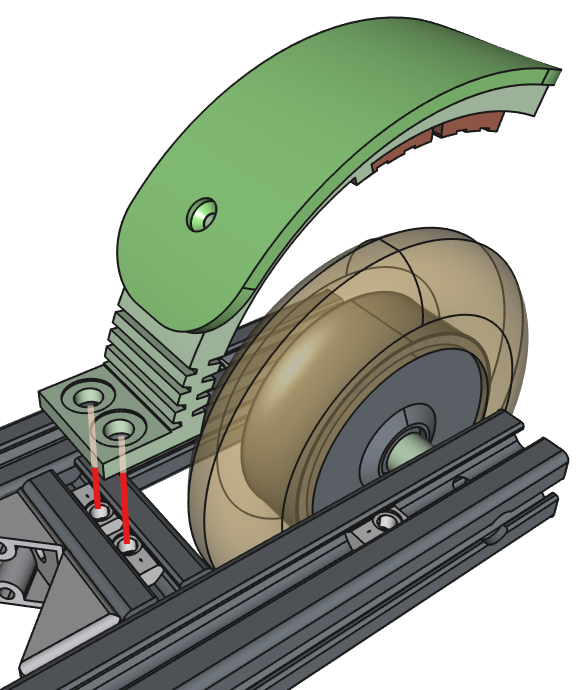  
        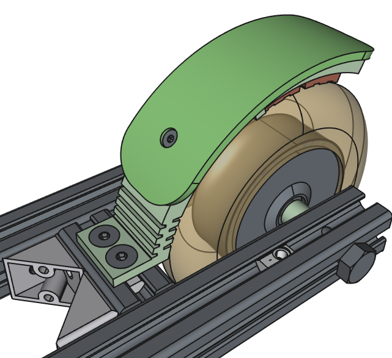  
        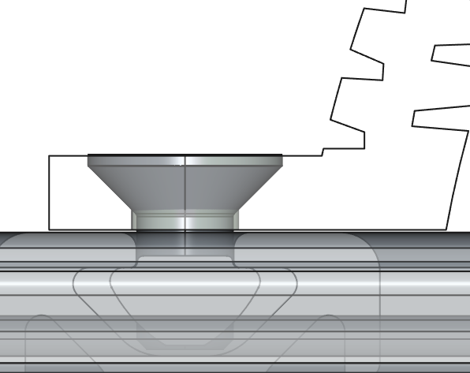
</td> <td> <ul>
        <li>Align the t-nuts in the frame with the holes of the brake</li>
        <li>Use two M5 x 10 countersunk screws to attach the brake to the t-nuts in the frame</li>
        <li>Make sure that the brake is centered</li>
          </ul>
</table>

<table> <tr> <td>
        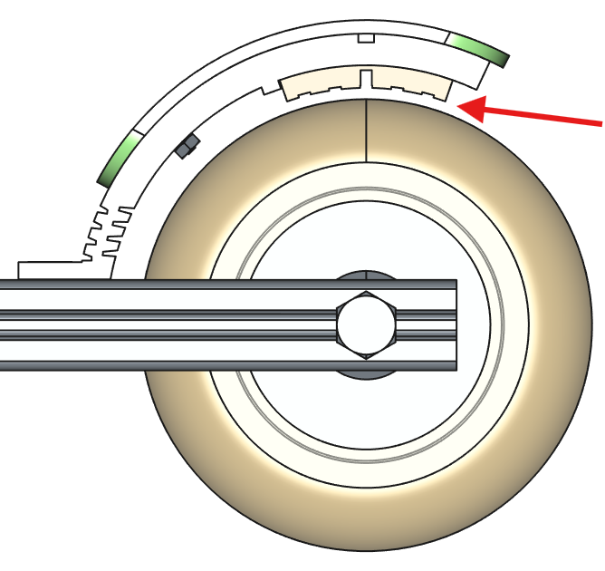
</td> <td> <ul>
        <li>Take a close look at the brake from the side. Make sure there is   a little gap between the brake block and the wheel</li>
        <li>Test: Spin the wheel quickly with your hand, then press the brake</li>
        <li>Take the scooter for another test ride. Don't ride too fast.   Step on the brake and test whether it works properly.</li>
        <li>⚠️ Careful! The brake could be stronger than you think.   If you ride too fast and step on the brake, you could come to a   really sudden stop, causing you to flip over the front.</li>
          </ul>
</table>
