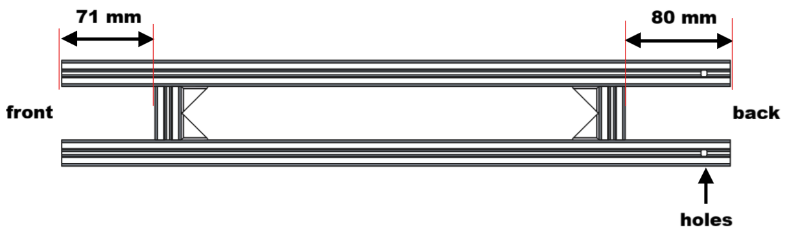
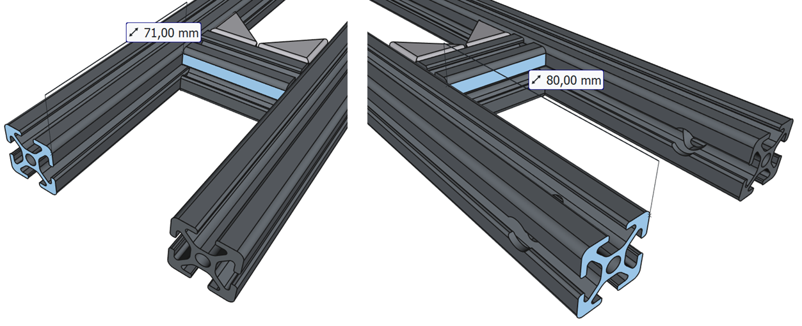
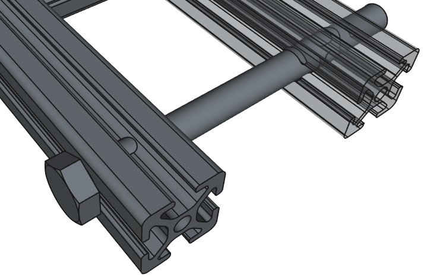

# Assembly

## Part list

Please check the part list in the [BOM section](Shopping_list.md)

## Tool list

Check that you have all the tools you need:

- A set of screw drivers and wrenches for hexagon screws (M3, M5 and M8)
- A set of allen keys
- Pliers

## Assembling the frame

<table> <tr> <td>       </td> <td> <ul>
        <li>Assamble the following 20x20 t-slot profiles:
          <ul>
            <li>length 509 mm (2 pieces)</li>
            <li>length 41 mm (2 pieces)</li>
          </ul>
        </li>
        <li>Use four 20x20 angles for mounting</li>
        <li>For each angle, you will need 2x M5 screws and 2x t-nuts</li>
        <li>Make sure to move the 41-mm-profiles to the right position (80 mm for the back part, 71 mm for the front part)</li>
        <li>Make sure that the drilled holes are in the back</li>
        <li>Make sure that everything is parallel and at right angles</li>
        <li>Insert the M8 x 95 screw through the holes and make sure that it fits well</li>
      </ul> </td> </tr> </table>

<table> <tr> <td>  </td> <td> <ul>
        <li>Insert 4x t-nuts (with M5 holes) in the frame (2 on each side)</li>
        <li>Insert them on the front part of the frame (where the distance of the profile is 71 mm and where are no holes)</li>
</table>
